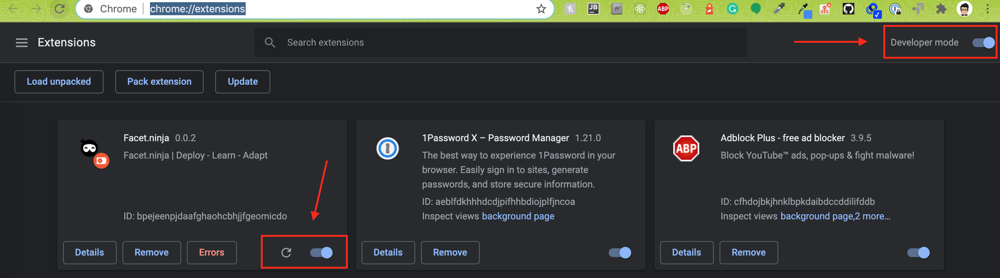

# Thank you for contributing to facet-extension!

## Start the project

### Build

### Install dependencies

```
yarn install
```

### Start

```
yarn start
```

### Build

```
yarn build
```

### See changes in chrome:

2. `yarn build`
3. Click the reload button next to the facet.ninja plugin and you are settled.



## Tests

Run tests with `yarn test`.

## Semantic Versioning (SemVer) [](https://semver.org/)

[Semantic Versioning](https://semver.org/) is utilized as means to versioning.

## Google Storage API

This is where the facet-extension reads values from. Here are some examples of how to CRUD it:

#### Read values from local storage:

```
chrome.storage && chrome.storage.sync.get('facet-settings', function (obj) {
    console.log('[local storage]:', obj);
});
```

#### Set values in local storage:

```
chrome.storage && chrome.storage.sync.get('facet-settings', function (obj) {
    console.log('[local storage]:', obj);
    const aboutToSet = {
        "facet-settings": {
            ...obj,
            enabled: true
        }
    };

    chrome.storage && chrome.storage.sync.set(aboutToSet, async function () {
        console.log(`[STORAGE] updated`);
    });
});
```

#### Clean local storage:

```
chrome.storage.sync.clear(function () {
    var error = chrome.runtime.lastError;
    if (error) {
        console.error(error);
    }
});
```

## Authentication

For trying out the plugin, you can try logging in with this account:

```
username: layani.kamora@primaryale.com
password: layani.kamora@primaryale.com
```

## Cookie Structure

```
FACET_EXTENSION_PREVIEW_TAB_ID: The TabID of Preview tab; updated onClick and on tab close consequently - Used by `facet-mutation-observer.js`
FACET_EXTENSION_DISABLE_MO:  Disables/enables the MO in an already integrated website - Used by the API's mutation observer script.
FACET_EXTENSION_ALREADY_INTEGRATED:  Domain is already integrated with facet.run
FACET_EXTENSION_INJECTING_SCRIPT_TAG:  script tag that ought to be injected
```
